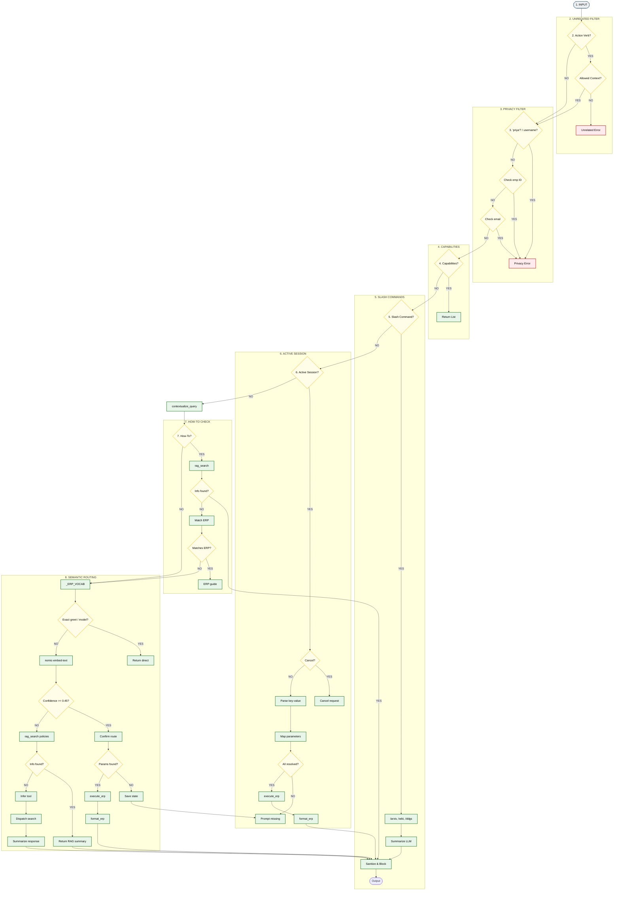

# Agnikul AXON Chatbot Service

This repository houses the **AXON-Server** orchestrator backend. Below is the detailed routing flow diagram of AXON query processing and orchestration, including all keyword matches, regex checks, and target functions.

---

## Query Processing & Routing Flow

---

## Complete Keyword Lists & Reference Index

### 1. Action Verbs Filter (`ACTION_VERBS`)
Searched when checking for unrelated actions:
* `send`, `mail`, `email`, `post`, `tweet`, `slack`, `schedule`, `delete`, `remove`, `download`, `install`, `execute`, `run`, `book`, `reserve`, `order`

### 2. Allowed Context Keywords (`ALLOWED_ACTION_CONTEXTS`)
Bypasses unrelated queries filter if any of the following match:
* `lost`, `found`, `food`, `log`, `ticket`, `feedback`, `suggestion`, `track`, `tracking`

### 3. Employee Privacy Checks
* **Block Target Names**: `priya` (unless user's email starts with "priya")
* **Allowed Bypass Names**: `srinath`, `moin`, `satyanarayanan`, `janardhana`, `ravichandran`, `spm`
* **ID Regex Pattern**: `\bemp\s*[-_]?\s*(\d+)\b`
* **Email Regex Pattern**: `\b[a-zA-Z0-9._%+-]+@[a-zA-Z0-9.-]+\.[a-zA-Z]{2,}\b`

### 4. Direct Slash Commands
Query prefix checks:
* `/arxiv`, `/wiki`, `/ddgs`

### 5. Active Session Cancel Keywords
* `cancel`, `stop`, `abort`, `nevermind`, `quit`, `exit`

### 6. Contextualizer Check
* **Ambiguous Pronouns**: `it`, `he`, `she`, `they`, `this`, `that`, `him`, `her`, `them`, `its`, `his`, `their`, `these`, `those`
* **Bypass Known Entities**: `agnikul`, `cosmos`, `agnibaan`, `agnilet`, `dhanush`, `sorted`, `launchpad`, `sdsc`, `shar`, `isro`, `axon`, `erp`, `srinath`, `moin`, `satyanarayanan`, `janardhana`, `ravichandran`, `spm`, `raju`, `chakravarthy`

### 7. How-To Indicators
* `how to`, `how do i`, `how can i`, `how should i`, `how does`, `how do we`, `how is`, `steps to`, `procedure to`, `guideline for`, `guide to`, `how do we go about`, `steps for`, `instruction for`, `instructions for`, `how do we do`

### 8. Typo Normalization Vocabulary (`_ERP_VOCAB`)
* `leave`, `balance`, `track`, `food`, `canteen`, `booking`, `log`, `meal`, `dinner`, `lunch`, `breakfast`, `ticket`, `feedback`, `suggestion`, `create`, `submit`, `raise`, `report`, `lost`, `found`, `item`, `management`, `support`, `erp`, `fleet`, `hr`, `payroll`, `finance`, `inventory`, `procurement`, `casual`, `sick`, `allocated`, `remaining`, `taken`

### 9. Greetings & Model Keywords
* **Greetings (`SIMPLE_GREETINGS`)**: `hi`, `hello`, `hey`, `hii`, `hola`, `hiya`, `yo`, `sup`, `greetings`
* **Identity Check (`MODEL_KEYWORDS`)**: `base model`, `model are you`, `llm are you`, `model you are using`, `llm you are using`, `what model`, `which model`, `which llm`, `what llm`, `model is this`, `model you use`, `llm you use`, `based on which`, `based on what`, `are you based on`, `are you llama`, `are you qwen`, `are you gpt`, `are you claude`, `are you gemini`, `are you deepseek`, `are you using llama`, `are you using qwen`, `are you using gpt`, `are you using deepseek`, `are you using gemini`, `are you using claude`

### 10. Parameter Extraction Helpers
* **Temporal Keywords**: `last week`, `this week`, `last month`, `this month`, `last year`, `this year`, `today`, `yesterday`, `tomorrow`
* **Priority Alias Map**: `critical` (P0), `urgent` (P0), `high` (P1), `medium` (P2), `moderate` (P2), `low` (P3), `minor` (P3)
* **Docname Match Prefix Regex**: `(?:PC|MM|MT|DL|LF|ERP_I|ERP-SF|FBSG|SUG|ERP-RU|ERP-FAQ|ERP-M|ERP_SF)[-_]\w+`
* **Ratings Match Patterns**: 
  - `\bratings?\s*[:=]?\s*([1-5](?:\.\d+)?)\b`
  - `\brate\s+(?:it\s+)?([1-5](?:\.\d+)?)\b`
  - `\b([1-5](?:\.\d+)?)\s*stars?\b`
  - `\bgive\s+(?:it\s+)?([1-5](?:\.\d+)?)\b`
* **Suggestion Benefit Indicators**: `would`, `helps to`, `helps`, `so that`, `to help`, `in order to`

### 11. Policy Rules Check
* **Keywords (`POLICY_KEYWORDS`)**: `policy`, `policies`, `guideline`, `guidelines`, `rules`, `rule`, `handbook`
* **Domains (`POLICY_DOMAINS`)**: `leave`, `leaves`, `food`, `canteen`, `cafeteria`, `meal`, `meals`, `breakfast`, `lunch`, `dinner`, `beverage`, `beverages`, `menu`, `catering`
