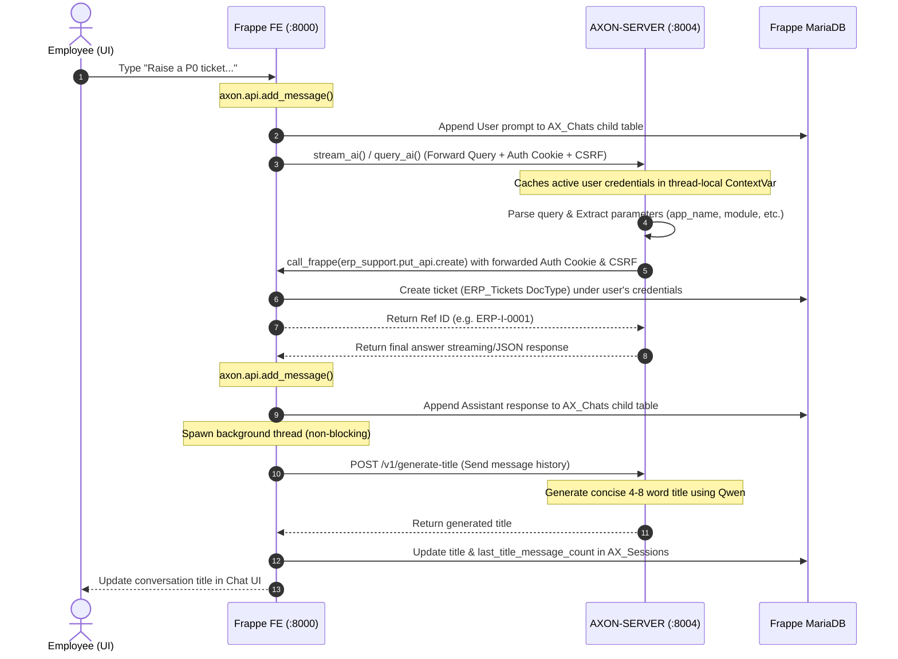

# Axon Orchestrator & Search Server

Axon is an intelligent, multi-hop internal enterprise AI assistant built for Agnikul Cosmos. It seamlessly manages ERP support actions (creating tickets, suggestions, feedback), retrieves organizational knowledge using RAG, and searches external repositories (Wikipedia, arXiv, DuckDuckGo) via a non-blocking event-loop architecture.

---

## 📂 Repository & Folder Directory Reference

Axon is composed of two primary layers: the **Frappe Frontend Application (FE)** and the **Orchestrator Backend Server (BE)**.

### 1. Frontend Repository Structure (FE - `apps/axon/`)
The frontend is integrated as a custom Frappe application that renders the chat dashboard and securely forwards session authentications.

```directory
apps/axon/
├── axon/
│   ├── api.py           # Core Proxy: Intercepts Chat UI calls, captures sid cookies & CSRF tokens, and securely proxies them to AXON-SERVER
│   ├── hooks.py         # Frappe Integrations: Registers routing hooks, API methods, and whitelisted app schemas
│   ├── public/          # Public Assets: Hosts index.html and modern static JS assets for the interactive Chat UI
│   └── www/
│       └── chat.html    # Web Route: Served by Frappe when employees visit http://localhost:8000/chat
```

### 2. Backend Repository Structure (BE - `apps/AXON-SERVER/`)
The orchestrator processes queries, extracts parameters, accesses vectors, and dispatches non-blocking search workers.

```directory
apps/AXON-SERVER/
├── main.py              # Server Entrypoint: Hosts FastAPI stream and query endpoints on port 8004
├── common/              # System Foundation Helpers
│   ├── router.py        # Intent Router: Parses keywords to categorize queries into Greetings, RAG, or External Tools
│   ├── rag_tool.py      # RAG Search Engine: Executes similarity search and formats answers with Qwen
│   ├── vector.py        # Vector Manager: Builds & loads the local database (chroma_langchain_db_user_local)
│   └── greeting.py      # Identity & Greetings: Answers general identity queries ("Who are you?")
├── orchestrator/        # Core Agent Orchestration
│   ├── query_processor.py  # Main Orchestrator: Directs classification, parameter extraction, and execution flow
│   ├── tool_dispatcher.py  # Search Dispatcher: Runs Wiki, arXiv, and DDGS searches in non-blocking thread workers
│   ├── erp_support_client.py # ERP PUT Client: Directs secure ticket/feedback/suggestion creation to Frappe API
│   ├── frappe_client.py    # Frappe Read Client: Queries registered apps, tickets, and document lists
│   └── planning/        # LLM Parameter Extraction Pipeline
│       └── parameter_extractor.py # AI Structured Extractor: Extracts fields using Langchain Qwen models and maps priority aliases
```

---

## 🏗️ System Architecture & Full Flow

Axon operates on a secure **4-Hop Architecture** that ensures complete CSRF safety, user session forwarding, and non-blocking background searches.

```mermaid
sequenceDiagram
    autonumber
    actor User as Employee (UI)
    participant Frappe as Frappe Backend (:8000)
    participant AxonServer as AXON-SERVER (:8004)
    participant LocalDB as Chroma Vector DB
    participant SearchService as Wiki/arXiv/DDGS Containers

    User->>Frappe: 1. Send Query (with Cookie & CSRF)
    Note over Frappe: Captures User Session (sid) & X-Frappe-CSRF-Token
    Frappe->>AxonServer: 2. Proxy Query + Forward Auth Headers
    Note over AxonServer: Caches Session Headers in ContextVar

    alt ERP Action (Ticket, Feedback, Suggestion)
        Note over AxonServer: Extracts Params & Maps Priority Aliases
        AxonServer->>Frappe: 3a. Securely Call ERP DocType Creator (with forwarded Cookie & CSRF)
        Frappe-->>AxonServer: 4a. DocType Created (e.g. ERP-SF-05-0004)
        AxonServer-->>User: 5a. Return Success Details & Ref ID
    
    elif Organization Query
        AxonServer->>LocalDB: 3b. Retrieve Embeddings & Context
        LocalDB-->>AxonServer: 4b. Match relevant policy blocks
        Note over AxonServer: Summarize & Phrase with LLM (Qwen)
        AxonServer-->>User: 5b. Return Natural Concise Answer

    elif External Search (wiki, arXiv, ddgs)
        Note over AxonServer: Cleans query terms (removes timing terms like "recent")
        AxonServer->>SearchService: 3c. Non-blocking HTTP fetch (asyncio.to_thread)
        SearchService-->>AxonServer: 4c. Search results
        Note over AxonServer: Summarize search data with LLM
        AxonServer-->>User: 5c. Return formatted search summary
    end
```

### The 4-Hop Flow Walkthrough
1. **Hop 1 (UI → Frappe):** The employee interacts with the Axon Chat interface at `http://localhost:8000/chat`. The browser attaches the active session cookie (`sid`) and the `X-Frappe-CSRF-Token` header to the API call.
2. **Hop 2 (Frappe → AXON-SERVER):** The Frappe backend (`axon.api.stream_ai`) intercepts the request, captures all auth headers, and proxies them to the AXON-SERVER instance running at `http://localhost:8004/v1/stream`.
3. **Hop 3 (Orchestration & Resolution):**
   * **Authentication Caching:** AXON-SERVER caches the session headers in a thread-local context (`ContextVar`).
   * **Intent Classification:** The query goes through `common/router.py`.
     * **ERP support actions** undergo natural language parameter extraction (`parameter_extractor.py`), validating fields like `app_name`, `module`, and mapping priority aliases (e.g. `High` → `P1`).
     * **Organization queries** perform a Chroma similarity search on the custom local database (`chroma_langchain_db_user_local`) and use Qwen to format a natural answer.
     * **External search requests** trigger Wikipedia (`wiki`), academic paper (`arxiv`), or DuckDuckGo (`ddgs`) lookups inside worker threads via `asyncio.to_thread`, preventing main event loop blocking.
4. **Hop 4 (Secure Execution):** When executing ERP actions, AXON-SERVER calls the Frappe API endpoint (`erp_support.put_api.create`) using the cached active user's session cookies and CSRF token, ensuring the database records are created under the correct user credentials.

## 🗄️ Custom API DocTypes & Session Lifecycle

To enable persistent conversations, intelligent session management, and dynamic tool configuration, Axon implements three custom **API DocTypes** on the Frappe framework.

### 1. The Custom API DocTypes

#### 📂 `AX_Sessions` (Document)
Manages the metadata, ownership, and active state of each distinct conversation session.
*   **`user_id`** (Data): Stores the email/username of the owning employee.
*   **`session_id`** (Data - Read Only - Unique): Auto-generated UUID indexing the conversation.
*   **`title`** (Data): Descriptive title dynamically generated/updated by Qwen.
*   **`title_generated`** (Check): Boolean flag indicating if an AI title has been generated.
*   **`last_title_message_count`** (Int): Number of messages included in the last title generation batch.
*   **`status`** (Select): `Active` or `Inactive`.
*   **`last_active`** (Datetime): Timestamp of the last interaction.
*   **`chats`** (Table): Child table containing the message sequence (links to `AX_Chats`).

#### 📂 `AX_Chats` (Child Table)
Stores individual conversation turn records inside a parent session (limited to 30 turns per session).
*   **`role`** (Select): `User` or `Assistant`.
*   **`content`** (Long Text): The textual body of the prompt or AI response.
*   **`token_count`** (Int): Tracks context usage.
*   **`sequence_number`** (Int): Sequential ordering index.

#### 📂 `AX_Tools` (Document)
Enables dynamic registration and runtime configuration of agent tools straight from the Frappe Desk.
*   **`tool_name`** (Data - Unique): Canonical name of the tool.
*   **`description`** (Text): Natural language description explaining what the tool does (used by the routing LLM).
*   **`status`** (Select): `Active` or `Inactive`.

---

### 2. How the Session & Integration Lifecycle Happens

The integration operates through a secure, bidirectional, and non-blocking event-driven architecture. Here is the step-by-step description of the flow:



#### 🔄 Step-by-Step Flow Walkthrough

1.  **Session Initiation & User Message Logging:**
    *   When the user opens the Chat dashboard, a session is initialized via `create_session()`, creating an `AX_Sessions` document.
    *   When the user sends a message, `add_message()` is triggered. It appends the message under the `User` role to the session's `AX_Chats` child table, assigning a sequential `sequence_number`.

2.  **Auth-Preserving Query Proxying:**
    *   The frontend invokes the custom `stream_ai()` or `query_ai()` endpoints.
    *   The API intercepts the request, captures the active `sid` session cookie and `X-Frappe-CSRF-Token` headers, and proxies them to the backend orchestrator `AXON-SERVER` on port `8004`.
    *   `AXON-SERVER` stores the user's authenticating headers in an asynchronous `ContextVar`, ensuring that any subsequent database query or mutation is safely performed on behalf of the logged-in user.

3.  **Autonomous Parameter Extraction & ERP Execution:**
    *   The backend orchestrator parses the query. If categorized as an ERP support action, the LLM processes it and identifies the parameters.
    *   Using the `mcp_registry.py` wrapper, the orchestrator triggers `call_frappe()` to call Frappe's remote PUT endpoint (`erp_support.put_api.create`), securely passing the forwarded active session cookies and CSRF token.
    *   Frappe executes the action and creates the requested document (`ERP_Tickets`, `ERP_Feedback_Suggestions`, or `Lost And Found`) under the active user's credentials, returning the record's primary key name back to the orchestrator.

4.  **Assistant Response Recording & Title Generation:**
    *   The final response is streamed/returned back to the custom API proxy, which appends the AI answer under the `Assistant` role to the `AX_Chats` table.
    *   Upon recording the assistant's response, a **non-blocking background thread** is spawned. The thread calls `AXON-SERVER`'s `/v1/generate-title` with the message batch.
    *   The server generates a premium, domain-specific conversation title using Qwen, and the background worker updates the `title` and `last_title_message_count` of the `AX_Sessions` record directly, avoiding UI thread freezing.

---

## 🧠 AI Parameter Extraction & Conversational Flows

When users speak naturally to create tickets, feedback, or suggestions, Axon does not expect rigid parameters. Instead, it utilizes **LLM-driven Structured JSON Parameter Extraction** powered by Qwen and LangChain schemas.

### 1. How the AI Parameter Extraction Works
1. **Structured Input Parsing:** The orchestrator runs `parameter_extractor.py` containing a highly optimized LangChain system prompt that binds to the Qwen LLM. The AI processes the natural text and parses it into structured fields.
2. **Transparent Priority Aliasing:** Employees write expressions like `"High"`, `"Medium"`, `"Critical"`, or `"Low"`. An internal translation map (`_PRIORITY_ALIAS_MAP`) maps them to Frappe-recognized priorities:
   * `"Critical"` / `"P0"` → `P0`
   * `"High"` / `"P1"` → `P1`
   * `"Medium"` / `"P2"` → `P2`
   * `"Low"` / `"P3"` → `P3`
3. **Intelligent Defaults:** If the user specifies no priority, the system automatically defaults it to `P2` (Medium), meaning priority is *never* a blocking parameter.
4. **Robust Param Isolation:** Advanced key-value regex patterns prioritize explicit formats (e.g. `feedback: <text>`) to prevent verbs (like *"Submit suggestions..."*) from polluting parsed parameters.

---

### 2. Scenario Walkthroughs for Partial Ticket Queries

If the user fails to provide the required fields (`app_name`, `module`, and `description`), AXON-SERVER raises a `MissingParametersError`. The orchestrator returns a clean `status: "missing"` response along with a friendly, AI-generated clarification query.

#### Scenario A: User provides only the description (missing App Name & Module)
*   **Natural Query:** `"My invoice page is stuck loading."`
*   **AI Extraction Output:**
    *   `description`: `"My invoice page is stuck loading."`
    *   `priority`: `"P2"` *(defaulted)*
    *   `app_name`: `None`
    *   `module`: `None`
*   **AXON-SERVER API Response:**
    ```json
    {
      "query_type": "erp",
      "status": "missing",
      "missing_fields": ["app_name", "module"],
      "message": "I'd be happy to open a support ticket for you, but I just need: application name, module. Could you tell me which app and module this is for?"
    }
    ```

#### Scenario B: User provides the App Name & Description (missing Module)
*   **Natural Query:** `"Raise a High priority support ticket for Finance app. The dashboard crashed."`
*   **AI Extraction Output:**
    *   `app_name`: `"Finance"`
    *   `description`: `"The dashboard crashed."`
    *   `priority`: `"P1"` *(mapped automatically from "High")*
    *   `module`: `None`
*   **AXON-SERVER API Response:**
    ```json
    {
      "query_type": "erp",
      "status": "missing",
      "missing_fields": ["module"],
      "message": "I just need one more detail to create your Finance support ticket: module. Which module did the crash occur in?"
    }
    ```

#### Scenario C: User provides all required fields (Success Flow)
*   **Natural Query:** `"Raise a critical ticket for app Finance module Accounts. Payments are failing."`
*   **AI Extraction Output:**
    *   `app_name`: `"Finance"`
    *   `module`: `"Accounts"`
    *   `description`: `"Payments are failing."`
    *   `priority`: `"P0"` *(mapped automatically from "critical")*
*   **AXON-SERVER API Response:**
    ```json
    {
      "query_type": "erp",
      "status": "ok",
      "message": "✓ Success! Ticket ERP-SF-05-0004 has been successfully created under Finance (Accounts) with P0 priority."
    }
    ```

---

## 🚀 Running the Server

### 1. Start Support Containers
Start the Wikipedia, arXiv, and DuckDuckGo search helper services:
```bash
cd /home/arjuna-automationsoftware/frappe-bench/apps/AXON-SERVER
docker compose up -d wiki arxiv ddgs
```

### 2. Start the AXON-SERVER Orchestrator
Run the FastAPI orchestrator service on host port `8004`:
```bash
OLLAMA_BASE_URL="http://localhost:11434" \
WIKI_URL="http://localhost:8002/query" \
DDGS_URL="http://localhost:8005/query" \
ARXIV_URL="http://localhost:8003/query" \
FRAPPE_URL="http://localhost:8000" \
.venv/bin/python main.py server --port 8004
```

---

## 📡 API Endpoints

FastAPI provides an interactive Swagger UI documentation at:
* 🌐 `http://localhost:8004/docs`

### 1. Unified Query Interface
* **Endpoint:** `POST http://localhost:8004/v1/query`
* **Body:**
  ```json
  {
    "query": "Who founded Agnikul Cosmos?"
  }
  ```
* **Sample Success Response (RAG):**
  ```json
  {
    "request_id": "e5add687-b129-4d1e-a3d5-816ca037edf5",
    "status": "ok",
    "response": "Agnikul Cosmos was founded by Srinath Ravichandran, Moin SPM, Satyanarayanan Chakravarthy, and Janardhana Raju."
  }
  ```

---

## ⚙️ Configuration (Environment Variables)

| Variable | Default Value | Description |
| :--- | :--- | :--- |
| `OLLAMA_BASE_URL` | `http://localhost:11434` | URL of the Ollama server hosting Qwen and mxbai |
| `FRAPPE_URL` | `http://localhost:8000` | URL of the local Frappe instance |
| `WIKI_URL` | `http://localhost:8002/query` | Wikipedia query service port |
| `ARXIV_URL` | `http://localhost:8003/query` | arXiv academic query service port |
| `DDGS_URL` | `http://localhost:8005/query` | DuckDuckGo web search service port |
