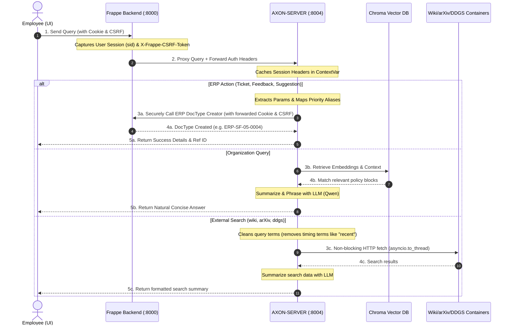
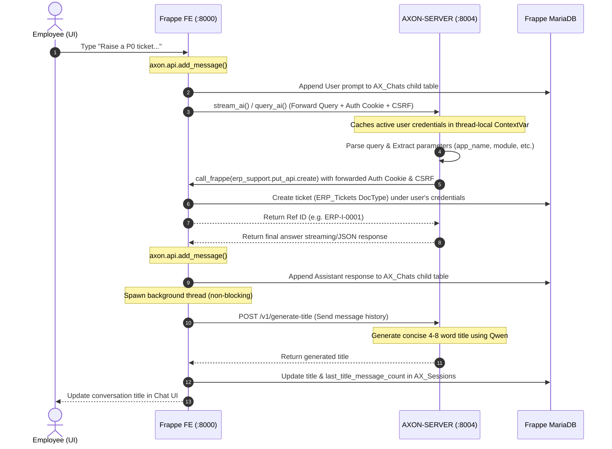
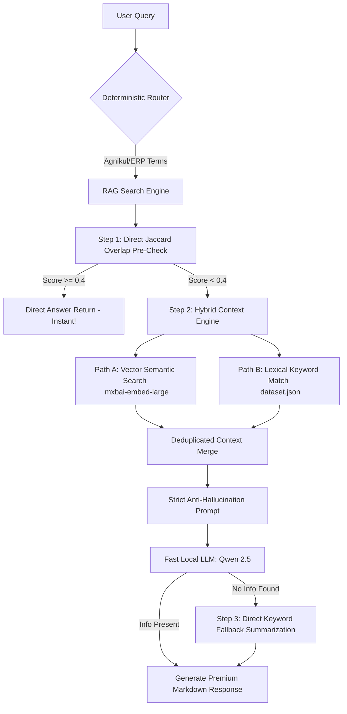
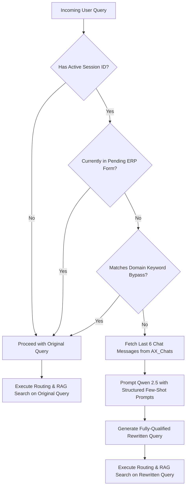

# Axon Orchestrator & Search Server

Axon is an intelligent, multi-hop internal enterprise AI assistant built for Agnikul Cosmos. It seamlessly manages ERP support actions (creating tickets, suggestions, feedback), retrieves organizational knowledge using RAG, and searches external repositories (Wikipedia, arXiv, DuckDuckGo) via a non-blocking event-loop architecture.

---

## 📂 Repository & Folder Directory Reference

Axon is composed of two primary layers: the **Frappe Frontend Application (FE)** and the **Orchestrator Backend Server (BE)**.

### 1. Frontend Repository Structure (FE - `apps/axon/`)
The frontend is integrated as a custom Frappe application that renders the chat dashboard and securely forwards session authentications.

```directory
apps/axon/
├── axon/
│   ├── api.py           # Core Proxy: Intercepts Chat UI calls, captures sid cookies & CSRF tokens, and securely proxies them to AXON-SERVER
│   ├── hooks.py         # Frappe Integrations: Registers routing hooks, API methods, and whitelisted app schemas
│   ├── public/          # Public Assets: Hosts index.html and modern static JS assets for the interactive Chat UI
│   └── www/
│       └── chat.html    # Web Route: Served by Frappe when employees visit http://localhost:8000/chat
```

### 2. Backend Repository Structure (BE - `apps/AXON-SERVER/`)
The orchestrator processes queries, extracts parameters, accesses vectors, and dispatches non-blocking search workers.

```directory
apps/AXON-SERVER/
├── main.py              # Server Entrypoint: Hosts FastAPI stream and query endpoints on port 8004
├── common/              # System Foundation Helpers
│   ├── router.py        # Intent Router: Parses keywords to categorize queries into Greetings, RAG, or External Tools
│   ├── rag_tool.py      # RAG Search Engine: Executes similarity search and formats answers with Qwen
│   ├── vector.py        # Vector Manager: Builds & loads the local database (chroma_langchain_db_user_local)
│   └── greeting.py      # Identity & Greetings: Answers general identity queries ("Who are you?")
├── orchestrator/        # Core Agent Orchestration
│   ├── query_processor.py  # Main Orchestrator: Directs classification, parameter extraction, and execution flow
│   ├── tool_dispatcher.py  # Search Dispatcher: Runs Wiki, arXiv, and DDGS searches in non-blocking thread workers
│   ├── erp_support_client.py # ERP PUT Client: Directs secure ticket/feedback/suggestion creation to Frappe API
│   ├── frappe_client.py    # Frappe Read Client: Queries registered apps, tickets, and document lists
│   └── planning/        # LLM Parameter Extraction Pipeline
│       └── parameter_extractor.py # AI Structured Extractor: Extracts fields using Langchain Qwen models and maps priority aliases
```

---

## 🏗️ System Architecture & Full Flow

Axon operates on a secure **4-Hop Architecture** that ensures complete CSRF safety, user session forwarding, and non-blocking background searches.



### The 4-Hop Flow Walkthrough
1. **Hop 1 (UI → Frappe):** The employee interacts with the Axon Chat interface at `http://localhost:8000/chat`. The browser attaches the active session cookie (`sid`) and the `X-Frappe-CSRF-Token` header to the API call.
2. **Hop 2 (Frappe → AXON-SERVER):** The Frappe backend (`axon.api.stream_ai`) intercepts the request, captures all auth headers, and proxies them to the AXON-SERVER instance running at `http://localhost:8004/v1/stream`.
3. **Hop 3 (Orchestration & Resolution):**
   * **Authentication Caching:** AXON-SERVER caches the session headers in a thread-local context (`ContextVar`).
   * **Intent Classification:** The query goes through `common/router.py`.
     * **ERP support actions** undergo natural language parameter extraction (`parameter_extractor.py`), validating fields like `app_name`, `module`, and mapping priority aliases (e.g. `High` → `P1`).
     * **Organization queries** perform a Chroma similarity search on the custom local database (`chroma_langchain_db_user_local`) and use Qwen to format a natural answer.
     * **External search requests** trigger Wikipedia (`wiki`), academic paper (`arxiv`), or DuckDuckGo (`ddgs`) lookups inside worker threads via `asyncio.to_thread`, preventing main event loop blocking.
4. **Hop 4 (Secure Execution):** When executing ERP actions, AXON-SERVER calls the Frappe API endpoint (`erp_support.put_api.create`) using the cached active user's session cookies and CSRF token, ensuring the database records are created under the correct user credentials.

### 📋 Example Queries & Mapping to Backend APIs

To clarify the relationship between user queries and the actual API endpoints invoked, the table below maps typical user queries to their resolved routes and corresponding Frappe API functions:

| User Query | Intent / Route Category | Target/Backend API | Endpoint / Method | Description |
| :--- | :--- | :--- | :--- | :--- |
| `"Raise a critical ticket for app Finance module Accounts. Payments are failing."` | **ERP Write (Creation)** | `erp_support.put_api.create` | `POST` | Creates a new support ticket (`ERP_Tickets`) on behalf of the user. |
| `"Give feedback for app HR saying system is great. Rating 5."` | **ERP Write (Creation)** | `erp_support.put_api.create` | `POST` | Creates a feedback entry (`ERP_Feedback_Suggestions`). |
| `"Suggest an improvement for app Payroll. Add dark mode."` | **ERP Write (Creation)** | `erp_support.put_api.create` | `POST` | Creates a suggestion entry (`ERP_Feedback_Suggestions`). |
| `"I lost my blue access card in the cafeteria."` | **ERP Write (Creation)** | `axon.api.create_lost_found` | `POST` | Creates a lost & found report record. |
| `"Show my support tickets"` | **ERP Read (Query)** | `erp_support.get_api.get_tickets` | `GET` | Retrieves tickets submitted by the logged-in employee. |
| `"List my suggestions and feedback"` | **ERP Read (Query)** | `erp_support.get_api.get_fb_sg` | `GET` | Retrieves feedback/suggestions submitted by the user. |
| `"Show active lost and found items"` | **ERP Read (Query)** | `core.factory.api.get_data` | `GET` | Retrieves active lost/found listings. |
| `"Track status of ticket PC-2026-0001"` | **ERP Read (Query)** | `packaging_management.get_api.view_details` (or prefix-specific helper) | `GET` | Views details of a specific record by prefix. |
| `"Show my meal bookings for this week"` | **ERP Read (Query)** | `food.api.log.food_log` | `GET` | Retrieves canteen booking history for a user. |
| `"What is the sick leave policy?"` | **Internal RAG** | Chroma DB / `dataset.json` | Local RAG Pipeline | Retrieves company leave guidelines from Vector DB. |
| `"Search Wikipedia for Machine Learning"` | **External Search** | Wikipedia Service Container | `POST` | Dispatches search query to external wiki service. |

---

## 🗄️ Custom API DocTypes & Session Lifecycle

To enable persistent conversations, intelligent session management, and dynamic tool configuration, Axon implements three custom **API DocTypes** on the Frappe framework.

### 1. The Custom API DocTypes

#### 📂 `AX_Sessions` (Document)
Manages the metadata, ownership, and active state of each distinct conversation session.
*   **`user_id`** (Data): Stores the email/username of the owning employee.
*   **`session_id`** (Data - Read Only - Unique): Auto-generated UUID indexing the conversation.
*   **`title`** (Data): Descriptive title dynamically generated/updated by Qwen.
*   **`title_generated`** (Check): Boolean flag indicating if an AI title has been generated.
*   **`last_title_message_count`** (Int): Number of messages included in the last title generation batch.
*   **`status`** (Select): `Active` or `Inactive`.
*   **`last_active`** (Datetime): Timestamp of the last interaction.
*   **`chats`** (Table): Child table containing the message sequence (links to `AX_Chats`).

#### 📂 `AX_Chats` (Child Table)
Stores individual conversation turn records inside a parent session (limited to 30 turns per session).
*   **`role`** (Select): `User` or `Assistant`.
*   **`content`** (Long Text): The textual body of the prompt or AI response.
*   **`token_count`** (Int): Tracks context usage.
*   `sequence_number` (Int): Sequential ordering index.

#### 📂 `AX_Tools` (Document)
Enables dynamic registration and runtime configuration of agent tools straight from the Frappe Desk.
*   **`tool_name`** (Data - Unique): Canonical name of the tool.
*   **`description`** (Text): Natural language description explaining what the tool does (used by the routing LLM).
*   **`status`** (Select): `Active` or `Inactive`.

---

### 2. How the Session & Integration Lifecycle Happens

The integration operates through a secure, bidirectional, and non-blocking event-driven architecture.



#### 🔄 Step-by-Step Flow Walkthrough

1.  **Session Initiation & User Message Logging:**
    *   When the user opens the Chat dashboard, a session is initialized via `create_session()`, creating an `AX_Sessions` document.
    *   When the user sends a message, `add_message()` is triggered. It appends the message under the `User` role to the session's `AX_Chats` child table, assigning a sequential `sequence_number`.

2.  **Auth-Preserving Query Proxying:**
    *   The frontend invokes the custom `stream_ai()` or `query_ai()` endpoints.
    *   The API intercepts the request, captures the active `sid` session cookie and `X-Frappe-CSRF-Token` headers, and proxies them to the backend orchestrator `AXON-SERVER` on port `8004`.
    *   `AXON-SERVER` stores the user's authenticating headers in an asynchronous `ContextVar`, ensuring that any subsequent database query or mutation is safely performed on behalf of the logged-in user.

3.  **Autonomous Parameter Extraction & ERP Execution:**
    *   The backend orchestrator parses the query. If categorized as an ERP support action, the LLM processes it and identifies the parameters.
    *   Using the `mcp_registry.py` wrapper, the orchestrator triggers `call_frappe()` to call Frappe's remote PUT endpoint (`erp_support.put_api.create`), securely passing the forwarded active session cookies and CSRF token.
    *   Frappe executes the action and creates the requested document (`ERP_Tickets`, `ERP_Feedback_Suggestions`, or `Lost And Found`) under the active user's credentials, returning the record's primary key name back to the orchestrator.

4.  **Assistant Response Recording & Title Generation:**
    *   The final response is streamed/returned back to the custom API proxy, which appends the AI answer under the `Assistant` role to the `AX_Chats` table.
    *   Upon recording the assistant's response, a **non-blocking background thread** is spawned. The thread calls `AXON-SERVER`'s `/v1/generate-title` with the message batch.
    *   The server generates a premium, domain-specific conversation title using Qwen, and the background worker updates the `title` and `last_title_message_count` of the `AX_Sessions` record directly, avoiding UI thread freezing.

---

## 🧠 AI Parameter Extraction & Conversational Flows

When users speak naturally to create tickets, feedback, or suggestions, Axon does not expect rigid parameters. Instead, it utilizes **LLM-driven Structured JSON Parameter Extraction** powered by Qwen and LangChain schemas.

### 1. How the AI Parameter Extraction Works
1. **Structured Input Parsing:** The orchestrator runs `parameter_extractor.py` containing a highly optimized LangChain system prompt that binds to the Qwen LLM. The AI processes the natural text and parses it into structured fields.
2. **Transparent Priority Aliasing:** Employees write expressions like `"High"`, `"Medium"`, `"Critical"`, or `"Low"`. An internal translation map (`_PRIORITY_ALIAS_MAP`) maps them to Frappe-recognized priorities:
   * `"Critical"` / `"P0"` → `P0`
   * `"High"` / `"P1"` → `P1`
   * `"Medium"` / `"P2"` → `P2`
   * `"Low"` / `"P3"` → `P3`
3. **Intelligent Defaults:** If the user specifies no priority, the system automatically defaults it to `P2` (Medium), meaning priority is *never* a blocking parameter.
4. **Robust Param Isolation:** Advanced key-value regex patterns prioritize explicit formats (e.g. `feedback: <text>`) to prevent verbs (like *"Submit suggestions..."*) from polluting parsed parameters.

---

### 2. Scenario Walkthroughs for Partial Ticket Queries

If the user fails to provide the required fields (`app_name`, `module`, and `description`), AXON-SERVER raises a `MissingParametersError`. The orchestrator returns a clean `status: "missing"` response along with a friendly, AI-generated clarification query.

#### Scenario A: User provides only the description (missing App Name & Module)
*   **Natural Query:** `"My invoice page is stuck loading."`
*   **AI Extraction Output:**
    *   `description`: `"My invoice page is stuck loading."`
    *   `priority`: `"P2"` *(defaulted)*
    *   `app_name`: `None`
    *   `module`: `None`
*   **AXON-SERVER API Response:**
    ```json
    {
      "query_type": "erp",
      "status": "missing",
      "missing_fields": ["app_name", "module"],
      "message": "I'd be happy to open a support ticket for you, but I just need: application name, module. Could you tell me which app and module this is for?"
    }
    ```

#### Scenario B: User provides the App Name & Description (missing Module)
*   **Natural Query:** `"Raise a High priority support ticket for Finance app. The dashboard crashed."`
*   **AI Extraction Output:**
    *   `app_name`: `"Finance"`
    *   `description`: `"The dashboard crashed."`
    *   `priority`: `"P1"` *(mapped automatically from "High")*
    *   `module`: `None`
*   **AXON-SERVER API Response:**
    ```json
    {
      "query_type": "erp",
      "status": "missing",
      "missing_fields": ["module"],
      "message": "I just need one more detail to create your Finance support ticket: module. Which module did the crash occur in?"
    }
    ```

#### Scenario C: User provides all required fields (Success Flow)
*   **Natural Query:** `"Raise a critical ticket for app Finance module Accounts. Payments are failing."`
*   **AI Extraction Output:**
    *   `app_name`: `"Finance"`
    *   `module`: `"Accounts"`
    *   `description`: `"Payments are failing."`
    *   `priority`: `"P0"` *(mapped automatically from "critical")*
*   **AXON-SERVER API Response:**
    ```json
    {
      "query_type": "erp",
      "status": "ok",
      "message": "✓ Success! Ticket ERP-SF-05-0004 has been successfully created under Finance (Accounts) with P0 priority."
    }
    ```

---

## 📋 ERP Support – Tickets, Feedback & Suggestions

### 1. Support Tickets

#### Basic Syntax
```text
Raise a <PRIORITY> ERP support ticket for app <APP_NAME> module <MODULE>. Description: <ISSUE>
```

#### Priority Scale
*   **P0** – System Down / Critical
*   **P1** – Major Feature Broken
*   **P2** – Performance Issue (Default)
*   **P3** – Minor Bug / Request

#### Examples
*   `"Raise a P0 ticket for app Finance module Dashboard. Dashboard not loading."`
*   `"Create a P1 ticket for app HR module Payroll. Salary calculations incorrect."`
*   `"Lodge a P2 support ticket for app Inventory module Reports. Reports are slow."`

---

### 2. Feedback Submissions

#### Basic Syntax
```text
Give feedback for app <APP_NAME> saying <FEEDBACK>. Rating <1-5>
```

#### Rating Scale
*   **1** – Poor
*   **2** – Fair
*   **3** – Good
*   **4** – Very Good
*   **5** – Excellent

#### Examples
*   `"Give feedback for app Finance. System is very responsive. Rating 5."`
*   `"Submit a review for HR app. Too many bugs. Rating 2."`
*   `"I want to give feedback for Inventory. Good but needs improvement. Rating 3."`

---

### 3. Product Suggestions

#### Basic Syntax
```text
Suggest an improvement for app <APP_NAME> priority <Low|Medium|High>. Feedback: <SUGGESTION>. Helps: <BENEFIT>
```

#### Suggestion Priorities
*   **Low** – Nice-to-have
*   **Medium** – Useful
*   **High** – Important

#### Examples
*   `"Suggest an improvement for Finance priority High. Add export to PDF. Helps: users download reports."`
*   `"Submit an idea for Payroll priority Medium. Auto-calculate deductions. Helps: saves time."`
*   `"Suggest enhancement for HR priority Low. Dark mode theme. Helps: reduce eye strain."`

---

### 4. Support Actions Parameter Reference

| Parameter Field | Required | Example | Notes |
| :--- | :--- | :--- | :--- |
| `app_name` | Yes | `Finance` | Must be a registered system application. |
| `priority` | Yes | `P0` or `High` | Standardized to P0-P3 or Low-High. |
| `module` | Yes | `Dashboard` | Sub-category of the application. |
| `description` | Yes | `Crash on launch` | Plain description of the bug. |
| `feedback` | Yes | `Incredibly smooth!` | Semantic feedback text. |
| `ratings` | Yes | `5` | Integer ratings from 1 to 5. |
| `helps` | Yes | `Saves employee time` | Business benefit statement. |

---

## 🏢 Organization Q&A & Web Search

Axon operates a dual-intent search layer that automatically queries Agnikul's RAG knowledge base for internal matters or search containers for public topics.

### 1. Organization RAG Questions
Ask about company founders, launch history, spaceships, or HR policies. The system combines exact keyword matches with high-dimensional vector embeddings for a perfect response:

*   **Company Info:**
    *   `"What does Agnikul Cosmos do?"`
    *   `"Who are the co-founders of the company?"`
    *   `"What is Dhanush?"`
*   **Internal Policies & HR:**
    *   `"What are the company leave policies?"`
    *   `"Does location matter while booking food?"`
    *   `"What should I select in food preference?"`
    *   `"Why is QR scanning required for food?"`
    *   `"How is food marked as consumed?"`

---

### 2. External Web Search Fallbacks
If a query does not mention Agnikul entities or internal policies, the system routes it to non-blocking academic and general search tools.

#### 📚 Wikipedia Queries
*   `"Who is Nikola Tesla on Wikipedia?"`
*   `"Search Wikipedia for Machine Learning"`

#### 🎓 Academic Paper Lookups (arXiv)
*   `"Search for machine learning papers on arXiv"`
*   `"Find recent papers on IoT and blockchain technology"`
*   *Output:* Automatically rendered in high-quality Markdown cards with **authors**, **year**, **abstract bullets**, and **direct links**.

#### 🌐 DuckDuckGo Web Search
*   `"Who is Virat Kohli?"`
*   `"What is a rocket engine?"`
*   *Output:* Serves as a self-healing fallback when arXiv times out or when standard definitions are requested.

---

### 3. Under the Hood: How Context-Based Answers Work (RAG Pipeline)

Axon's organization query system is powered by an advanced **Hybrid Retrieval-Augmented Generation (RAG)** pipeline designed to ensure absolute factual accuracy and sub-second response times:



#### 🛡️ The 3-Step Retrieval Lifecycle:

1. **Step 1: Fast-Path Direct Overlap (Zero-Latency)**
   * Before executing heavy vector comparisons or LLM queries, the query undergoes a Jaccard token overlap check against the exact stored titles and questions in `dataset.json`. 
   * If an exact or highly confident match is found (score $\ge 0.4$), the pre-written factual content is returned **instantly**, bypassing LLM processing entirely and achieving near-zero latency.

2. **Step 2: Dual Hybrid Retrieval (Vector + Keyword)**
   * **Semantic Vector Search:** The query is embedded using Ollama's `mxbai-embed-large` and matched against a local **Chroma DB** to extract the top 5 semantically similar document blocks.
   * **Lexical Keyword Search:** In parallel, the query is parsed and matched using exact word boundaries against the `title`, `content`, `keywords`, and `questions` fields of all indexed materials.
   * **The Merge:** Both contexts are merged and deduplicated to construct a rich, highly relevant source block.

3. **Step 3: Strict Anti-Hallucination Prompter & local LLM**
   * The context and user query are fed to a local **Qwen 2.5 (1.5B)** model. 
   * The model operates under a highly constrained template:
     > *"Answer using ONLY the facts in the Context. Do NOT use outside knowledge. If the answer is not in the Context, say: 'I don't have that information in my knowledge base.'"*
   * This guarantees that the assistant **never hallucinates** general web facts and only replies with verified Agnikul documents.
   * **Self-Healing Fallback:** If the LLM indicates a lack of information in the combined context, the system automatically falls back to summarize exclusively using the exact keyword matches to pull out obscure factual details.

---

## 💬 Contextual Answers & Conversational Query Resolution

To deliver a high-quality, human-like chat experience, Axon implements an advanced, stateful **Conversational Contextualization Layer**. Instead of treating every prompt as an isolated single turn, Axon tracks the state of the conversation, resolves ambiguous pronouns or missing nouns in follow-up queries, and maps them to accurate factual context.



### 1. How Contextual Answers are Generated (End-to-End Pipeline)

When a user submits a follow-up query such as *"Who founded it?"* or *"What is the limit?"*, the system resolves context and generates answers through the following stages:

#### 📂 Stage A: Stateful History Retrieval
* Axon uses the custom `AX_Sessions` and `AX_Chats` custom DocTypes inside the Frappe database to maintain conversation history.
* At the beginning of each turn, the orchestrator issues a fast internal call (`axon.api.get_session`) using the active `session_id`.
* The system pulls the last **6 conversation turns** (alternating `User` and `Assistant` roles) to build the short-term context window.

#### 🧠 Stage B: The Pronoun & Ellipsis Resolution Engine
* If the query is not in a pending form state, it is analyzed by a local **Qwen 2.5 (1.5B)** model specialized in conversational rewrites.
* The model evaluates the query against the retrieved chat history using a structured few-shot prompt.
* **Result:** It generates an independent, fully-qualified search string (e.g., rewriting *"Who is the owner?"* into *"Who is the owner of Agnikul Cosmos?"*).

#### ⚡ Stage C: Zero-Latency Domain Bypass
* To save LLM processing latency and protect specific terminology from unintended modification, the system matches the query against an optimized, pre-compiled registry of **70+ corporate and domain-specific terms** (e.g., *agnibaan*, *dhanush*, *leaves*, *canteen*, *payroll*, *ticket*, *feedback*, *quality*).
* If any matching term is detected, the query is passed **directly** to the RAG system, bypassing LLM rewriting entirely.

#### 🛡️ Stage D: Contextual Synthesis & Anti-Hallucination
* The rewritten query is used to run a hybrid search (vector similarity on **Chroma DB** + keyword scan on `dataset.json`).
* The retrieved context and the rewritten query are packaged inside a strict anti-hallucination prompt.
* The local **Qwen 2.5** model synthesizes the final response using *only* the retrieved facts.
* This final answer is streamed back to the chat dashboard and appended to the `AX_Chats` database.

---

### 2. Multi-Turn Session Memory Security

> [!IMPORTANT]
> The contextual rewriter is automatically suspended if the session is currently in a pending ERP action flow (e.g., creating a ticket or reporting a lost/found item). 
> This **ERP Form Safety-Lock** guarantees that simple slot-filling answers (like typing `"Cafeteria"` in response to a lost location prompt) are not mangled by the conversational rewriter, ensuring perfect administrative data integrity.

---

### 3. Contextualization In Action (Examples)

| Preceding Conversation Context | Ambiguous Follow-Up Query | Resolving Action | Rewritten Query (Used for Search) |
| :--- | :--- | :--- | :--- |
| **User:** What is Agnikul Cosmos?<br>**Assistant:** It is a private aerospace company in India. | *Who founded it?* | Resolves pronoun *"it"* to *"Agnikul Cosmos"*. | **Who founded Agnikul Cosmos?** |
| **User:** Tell me about Agnikul Cosmos.<br>**Assistant:** They build launch vehicles. | *Who is the owner?* | Resolves possessive context to the primary subject. | **Who is the owner of Agnikul Cosmos?** |
| **User:** What are the food preferences?<br>**Assistant:** You can choose Veg or Non-veg. | *How do I select them?* | Resolves *"them"* to *"food preferences"*. | **How do I select food preferences?** |
| **User:** Can I book cabs?<br>**Assistant:** Yes, you can book cabs through the Fleet app. | *What is the limit?* | Resolves missing noun context based on cab history. | **What is the limit for booking cabs?** |

---

## Axon UI Testing Suite & Scenarios

Use this manual suite to test all orchestrator behaviors directly inside the interactive UI chat dashboard (`http://localhost:8000/chat`):

### 1. Lost and Found Items Creation
Verify multi-turn parameter extraction for lost items:

| Step | User Query | Expected Behavior & UI Output |
| :--- | :--- | :--- |
| **1** | `I lost my item` | **Lost greeting is shown:** Prompts for **Item Name**, **Lost Location**, and **Lost Description** using a codeblock template. |
| **2** | `item_name: Access Card, lost_location: Cafeteria` | **Single missing parameter update:** Prompts politely for **Lost Description** only. |
| **3** | `It is a blue card with my employee photo.` | **Success message:** Returns record creation ref: `LF-29-0529-XXXXX` |

### 2. Found Item Reports
Verify updating an item as found (triggers existing schema validation):

| Step | User Query | Expected Behavior & UI Output |
| :--- | :--- | :--- |
| **1** | `I found a lost item` | **Found greeting is shown:** Prompts for **Record Name**, **Found Location**, **Found Date**, and **Found Description**. |
| **2** | `name: LF-27-0526-00010, found_location: Cafeteria desk` | **Partial update:** Asks for **Found Date** and **Found Description** only. |
| **3** | `found_date: today, found_description: Left it at the reception.` | **Success message:** Confirms database update. |

### 3. Support Tickets (Isolated Turn)
Verify that general support ticket routing does NOT pollute the lost and found templates:

| Step | User Query | Expected Behavior & UI Output |
| :--- | :--- | :--- |
| **1** | `I want to raise a support ticket` | **Ticket greeting is shown:** Prompts for **Application Name**, **Priority**, **Module**, and **Description**. |
| **2** | `app_name: fleet_management, priority: High, module: Vehicle Tracking` | **Single missing parameter update:** Prompts politely for **Description** only. |
| **3** | `GPS coordination is lagging and updating only every 5 minutes` | **Success message:** Returns successful ticket reference ID `ERP_I_...` |

---

## 🛠️ Developer Integration Guide

### 1. Programmatic Python Execution
You can easily trigger the orchestrator's parsing logic from any python client or script:

```python
from orchestrator.query_processor import process_query
import asyncio

async def run():
    # Example 1: RAG Query
    rag_resp = await process_query("What does Agnikul Cosmos do?")
    print("RAG Response:", rag_resp["message"])
    
    # Example 2: List ERP Tickets
    list_resp = await process_query("Show my support tickets")
    print("ERP Response:", list_resp["message"])

asyncio.run(run())
```

### 2. Programmatic Interactive Session Manipulation
Interact with the custom `AX_Sessions` and `AX_Chats` DocTypes in Python:

```python
import frappe

# 1. Programmatically initialize a session
session = frappe.get_doc({
    "doctype": "AX_Sessions",
    "user_id": "employee@agnikul.in",
    "session_id": "test-uuid-1234",
    "title": "Initial Chat Setup",
    "status": "Active"
})
session.insert(ignore_permissions=True)

# 2. Append a user message
session.append("chats", {
    "role": "User",
    "content": "Raise a ticket for Fleet Management.",
    "sequence_number": 1
})
session.save(ignore_permissions=True)
frappe.db.commit()
```

---

## 🚀 Running the Server

### 1. Start Search Container Backends
Start the non-blocking Wikipedia, arXiv, and DuckDuckGo search helper microservices:
```bash
cd /home/arjuna-automationsoftware/frappe-bench/apps/AXON-SERVER
docker compose up -d wiki arxiv ddgs
```

### 2. Run the FastAPI Orchestrator
Run the central FastAPI orchestrator service on host port `8004`:
```bash
OLLAMA_BASE_URL="http://localhost:11434" \
WIKI_URL="http://localhost:8002/query" \
DDGS_URL="http://localhost:8005/query" \
ARXIV_URL="http://localhost:8003/query" \
FRAPPE_URL="http://localhost:8000" \
.venv/bin/python main.py server --port 8004
```

---

## 📡 API Endpoints

FastAPI provides an interactive Swagger UI documentation at:
* 🌐 `http://localhost:8004/docs`

### 1. Unified Query Interface
*   **Endpoint:** `POST http://localhost:8004/v1/query`
*   **Body:**
    ```json
    {
      "query": "Who founded Agnikul Cosmos?"
    }
    ```
*   **Sample Success Response (RAG):**
    ```json
    {
      "request_id": "e5add687-b129-4d1e-a3d5-816ca037edf5",
      "status": "ok",
      "response": "Agnikul Cosmos was founded by Srinath Ravichandran, Moin SPM, Satyanarayanan Chakravarthy, and Janardhana Raju."
    }
    ```

---

## ⚙️ Configuration (Environment Variables)

| Variable | Default Value | Description |
| :--- | :--- | :--- |
| `APP_ENV` | `local` | Environment deployment target: `local`, `test`, or `prod` |
| `OLLAMA_BASE_URL` | `http://localhost:11434` | URL of the Ollama server hosting Qwen and mxbai |
| `FRAPPE_URL` | *Loaded dynamically* | URL of the Frappe instance, resolved based on `APP_ENV` |
| `WIKI_URL` | `http://localhost:8002/query` | Wikipedia query service port |
| `ARXIV_URL` | `http://localhost:8003/query` | arXiv academic query service port |
| `DDGS_URL` | `http://localhost:8005/query` | DuckDuckGo web search service port |

### Multi-Environment Configurations

The system dynamically loads configuration files based on the `APP_ENV` variable set in the main `.env` file:
* **Local Development (`APP_ENV=local`)**: Loads `.env.local` containing `FRAPPE_URL=http://host.docker.internal:8000`
* **Test Server (`APP_ENV=test`)**: Loads `.env.test` containing `FRAPPE_URL=http://14.99.126.171`
* **Production Server (`APP_ENV=prod`)**: Loads `.env.prod` containing `FRAPPE_URL=https://erp.agnikul.in`

---

## ✅ Troubleshooting & Diagnostics

### 1. Common ERP Errors
*   **Error: `"Could not find Application Name: XYZ"`**
    *   *Cause:* The application name provided does not exist in the whitelisted registry.
    *   *Solution:* Type `"List available apps"` to see the exact whitelisted app names and modules.
*   **Error: `"No tickets found"`**
    *   *Cause:* The logged-in employee has not created any support tickets.
    *   *Solution:* Create a new ticket first with `"Raise a ticket..."` to see active listings.

### 2. Search Diagnostics
*   **Search returns no results:**
    *   *Cause:* Search keywords are too specific or out of range.
    *   *Solution:* Generalize terms (e.g. search for `"Machine Learning"` instead of `"Exact specific ML subset"`).
*   **Search latency:**
    *   *Cause:* Querying multiple external docker containers simultaneously.
    *   *Solution:* This is normal behavior due to concurrent threading; the responses are safely handled without event loop blocking.

---

**Version:** 1.1  
**Last Updated:** 5 June 2026  
**Status:** Production Ready & Optimized
